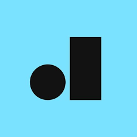

<h1 align="center">
  
</h1>

<p align="center">
  
</p>


## 💻 Project

An example of Portuguese dictionary to search words by Api and on DeepSeek IA.

# Team

- Here must contain the names of everyone in the team, at the moment that
  project is created
  - React Native Engineer: Alexandre Marques

# To Navigation

- expo-router.

## Features

- [ ] Search Words.
- [ ] Storage Searched words.
- [ ] Random words.

## ✨ Technologies

- [ ] Expo.
- [ ] React Native.
- [ ] Styled-components.
- [ ] Commitizen
- [ ] React Native Circular Progress

## Running the project

### Run Expo Environment

```
npx expo start / yarn start -c
```

### Run Expo Environment

### To Test with DeepSeek IA

```
install ollama
ollama run deepseek-r1:1.5b
```

**Install dependencies**

```
npm / yarn
```

**Install IOS Pods**

```
cd ios && pod install
```

**Run IOS**

```
yarn ios
```

**Run Android**

```
yarn android
```

## Running the tests

Use **yarn test** to execute the jest tests.

```cl
yarn test
```

<br />

# Project Structure

```bash
  App
    ├── (tabs)
    ├── assets
    │   └── images
    ├── components
    ├── constants
    ├── contexts
    ├── hooks
    ├── models
    ├── styles
        └── dark
        └── light
```

<div align="center">
  <small>Developed By Alexandre Marques - 2025/Fev</small>
</div>
